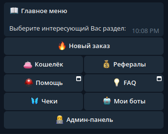

# Social Network Promotion via Telegram Bot

<p align="center">
  <a href="https://github.com/TegroTON/SMMPanel-SMOService-Telegram-Bot">
    
  </a>

  <h3 align="center">Automated Social Network Promotion via Telegram Bot</h3>

  <p align="center">
    An advanced automation system for promoting social network presence, utilizing a Telegram bot interfaced with the APIs of SmmPanel and SMOFast services.
    <br/><br/>
    <a href="https://github.com/TegroTON/SMMPanel-SMOService-Telegram-Bot"><strong>Explore the Documentation »</strong></a>
    <br/><br/>
    <a href="https://t.me/smoservicemedia_bot">View Demo</a> · 
    <a href="https://github.com/TegroTON/SMMPanel-SMOService-Telegram-Bot/issues">Report Bug</a> · 
    <a href="https://github.com/TegroTON/SMMPanel-SMOService-Telegram-Bot/pulls">Request Feature</a>
  </p>
</p>


## Table of Contents

- [About The Project](#about-the-project)
- [Key Features](#key-features)
- [Getting Started](#getting-started)
  - [Prerequisites](#prerequisites)
  - [Installation Guide](#installation-guide)
- [Suggestions and Known Issues](#suggestions-and-known-issues)
- [Authors](#authors)
- [Acknowledgements](#acknowledgements)

## About The Project



🚀 SMOService & RosMedia - Your ideal tools for social network promotion! Gain more followers, views, and much more with ease and efficiency.

### Key Features

- **New Order**: Quickly and conveniently create an order for the desired promotion.
- **History**: Track all your orders and their status in one place.
- **Wallet**: Manage your funds, top up your balance, and pay for services.
- **Referrals**: Invite friends and acquaintances, earning rewards for their activities.
- **Checks**: Share funds using a simple link for transfers.
- **My Bots**: Unique feature! Create a copy of this bot with a new ID.

Join us and make your account popular!

## Key Technologies

The bot is developed using cutting-edge technological solutions, ensuring high performance and stable operation. Asynchronous libraries allow the bot to process a large number of requests quickly and efficiently, meeting the high demands of modern users.

- [Python 3](https://www.python.org/downloads/)
- [Aiohttp](https://docs.aiohttp.org/en/v3.8.6/web_advanced.html)
- [Aiogram](https://aiogram.dev/)
- [SQLite](https://www.sqlite.org/index.html)

## Getting Started

To set up the bot successfully and ensure stable operation, follow these technical requirements:

### Server Requirements

- **Hosting**: VPS or dedicated server recommended for optimal performance and reliability. Ensure a stable internet connection and adequate resources (CPU, RAM) depending on expected load.
- **Operating System**: Modern Linux distributions such as Ubuntu, CentOS, or Debian are recommended. Most UNIX-like systems are also suitable.
- **Software**:
  - **Python 3**: Ensure the latest stable version of Python 3 is installed. This is the primary programming language for the bot.
  - **Pip**: A package management system for Python, necessary for installing required libraries and dependencies.
  - **Note**: Before setup, ensure all software is up-to-date and all dependencies are installed.

### Prerequisites

To automatically install all the required libraries, you can use the requirements.txt file with the above contents by running the command:

```sh
pip install -r requirements.txt
```
### Installation Guide

#### Step 1: Configuring the .env File for Your Bot

To ensure your bot operates correctly, you need to properly set up the .env configuration file. Follow these steps:

1. **Create a Copy of the .env.dist File**
   - Make a copy of the `.env.dist` file and rename it to `.env`:
  
        ```sh
            cd /path_to_bot_directory
            mv .env.dist .env
        ```

2. **Edit the .env File**
   - Open the `.env` file and edit the variables as required.
  
 ```env
BOT_URL=  # URL to your bot's server
HOST=127.0.0.1  # Host IP (127.0.0.1 for localhost)
PORT=  # Port to be used for the server

# Bot Settings
BOT_TOKEN=  # Token received from @BotFather
ADMIN_ID=  # Telegram ID of the bot's administrator
MAIN_BOT_PATH=  # Webhook path for the main bot
OTHER_BOTS_PATH=  # Webhook path for user-created bots

# Tegro Shop Configuration (Active)
TEGRO_API_URL=https://tegro.money/pay/  # Tegro Shop API endpoint
TEGRO_SHOP_ID=  # Your Tegro.money shop ID
TEGRO_API_KEY=  # API key for your Tegro.money shop
TEGRO_SECRET_KEY=  # Secret key for your Tegro.money shop

# Cryptopay Configuration (Active)
CRYPTO_TOKEN=  # Token for your Cryptopay shop
CRYPTO_TOKEN_TEST=  # Token for your Cryptopay shop in Testnet environment

# Ton Wallet Configuration (Under Development)
WPAY_STORE_API_KEY=  # API key for your Ton Wallet store

# Unitpay Configuration (Under Development)
UNITPAY_API_URL=https://unitpay.ru/api  # Unitpay API endpoint
UNITPAY_PROJECT_ID=  # Project ID for your UnitPay store
UNITPAY_SECRET_KEY=  # Secret key for your UnitPay store

# Cloudpayments Configuration (Under Development)
CLOUDPAYMENTS_API_URL=https://api.cloudpayments.ru  # Cloudpayments API endpoint
CLOUDPAYMENTS_PUBLIC_ID=  # Public ID for Cloudpayments
CLOUDPAYMENTS_SECRET_KEY=  # Secret key for Cloudpayments

# SmoService Configuration
SMOSERVICE_KEY=  # API key for your SmoService account
SMOSERVICE_USER_ID=  # User ID for your SmoService account

# SmmPanel Configuration
SMMPANEL_KEY=  # API key for SmmPanel

# Scheduled Tasks Intervals
CHECK_ORDER_STATUS_INTERVAL=120  # Interval (in seconds) to check order status
AUTO_STARTING_ORDERS_INTERVAL=60  # Interval (in seconds) to activate new orders

# WebApp Links
HELP_URL=https://ros.media/faq  # URL for "Help" button
FAQ_URL=https://smoservice.media/faq.php  # URL for "FAQ"

# Broadcast Messages Configuration
BROADCAST_MESSAGES_PER_SECOND=10 # Number of broadcast messages sent per minute

# Debug Mode
DEBUG=0 # Set to 1 to enable debug mode
 ```
   - Save and close the `.env` file after making the necessary changes.

#### Step 2: Obtaining an HTTPS Certificate Through Certbot

For secure communication with your server, it's recommended to use an HTTPS certificate. To obtain one, proceed as follows:

1. **Visit Certbot's Official Website**
   - Go to [Certbot's official website](https://certbot.eff.org/).

2. **Select Your Web Server and Operating System**
   - On the website, select the web server software and operating system you are using on your server.

3. **Follow the Installation Instructions**
   - Adhere to the guided instructions provided on the site for installing and setting up Certbot. This typically involves executing several commands in your terminal or command line.

4. **Certificate Key Location**
   - After successful setup and acquisition of the certificate, Certbot will display information about the location of the certificate keys in the console.
   - Take note or save the following paths:
     - Path to your private key (usually `privkey.pem`)
     - Path to the full chain certificate (usually `fullchain.pem`)

5. **Specify the Saved Paths in Your Configuration File**
   - Input the saved paths in your configuration file or wherever necessary for setting up your server.

⚠️ **Important Security Note**: Never share your private keys. Ensure they have appropriate access rights to be inaccessible to everyone except necessary services and the administrator.

### Step 3: Configuring Nginx for Your Telegram Bot

Proper configuration of the Nginx web server is crucial for your Telegram bot to handle requests effectively. Follow these detailed steps for setup:

#### 3.1 Installation and Basic Configuration of Nginx

1. **Install Nginx**: 
   - Execute the command to install Nginx on your server.
  
     ```sh
        sudo apt-get install -y nginx
     ```

2. **Navigate to the Sites-Available Directory**:
   - Change to the directory where Nginx site configurations are stored.
  
     ```sh
        cd /etc/nginx/sites-available/
     ```

3. **Create and Edit a New Configuration File**:
   - Use a command to create and open a new configuration file for your bot.
  
     ```sh
        sudo nano telegram_bot.conf
     ```

#### 3.2 Configuring the File

- In the opened editor, input the Nginx configuration. Be sure to replace paths to your SSL certificate and key with the ones obtained earlier and modify the server name to match your server's hostname.

    ```nginx
    server {
        listen 80;
        listen 443 ssl;
        server_name "your_server_domain_name";
        ssl_certificate "path_to_certificate";
        ssl_certificate_key "path_to_certificate_key";
        location / {
            proxy_set_header Host $http_host;
            proxy_redirect off;
            proxy_set_header X-Forwarded-For $proxy_add_x_forwarded_for;
            proxy_set_header X-Real-IP $remote_addr;
            proxy_set_header X-Scheme $scheme;
            proxy_pass http://localhost:8001/;
        }
    }
     ```
  
- Save and close the file after editing.

#### 3.3 Activating and Restarting Nginx

1. **Navigate to the Active Configurations Directory**:
   - Move to the directory where active Nginx configurations are stored.

  ```sh
        cd /etc/nginx/sites-enabled/
  ```

2. **Create a Symbolic Link to Your Configuration File**:
   - Use a command to create a symbolic link from your configuration file in 'sites-available' to 'sites-enabled'.
  
   ```sh
    sudo ln -s ../sites-available/telegram_bot.conf telegram_bot.conf
   ```

3. **Restart Nginx to Apply Changes**:
   - Execute a command to restart Nginx, making your configuration changes effective.
  
   ```sh
    sudo service nginx restart
   ```

### Step 4: Creating a Systemd Service for Your Bot

To ensure your bot remains operational at all times and automatically restarts after server reboots or unexpected shutdowns, create a systemd service.

#### 4.1 Creating the Service Configuration File

1. **Navigate to the Systemd Directory**:
   - Change to the systemd directory where service configuration files are stored. Typically, it's `/etc/systemd/system/`.
  
   ```sh
        cd /etc/systemd/system/
   ```

2. **Create and Open a New Service File**:
   - Execute a command to create and open a new file for your service. For example, you might use `sudo nano /etc/systemd/system/your_bot.service`.
  
    ```sh
    vim tgbot.service
    ```

#### 4.2 Configuring the Service File

- In the editor, input the following configuration. Remember to replace the executable path and username with your specific details:

    ```sh
    [Unit]
    Description=Telegram Bot Service

    [Service]
    WorkingDirectory='working directory path'
    User='user name'
    ExecStart=/usr/bin/python3 main.py

    [Install]
    WantedBy=multi-user.target
    ```    

#### 4.3 Activating and Starting the Service

- Activate and Enable Automatic Start:

Use the command sudo systemctl enable your_bot.service to enable the service to start on boot.

  ```sh
    sudo systemctl enable tgbot.service
  ```

- Start Your Bot Using the Created Service:

To start your bot immediately using the service, execute: sudo systemctl start your_bot.service.

  ```sh
    sudo systemctl start tgbot.service
  ```

Check the Status of Your Bot:

```sh
sudo systemctl status tgbot.service
```
To verify that your bot is running correctly, use the command: sudo systemctl status your_bot.service.

## Suggestions and Known Issues

For a list of proposed features and known issues, please see the ["Issues"](https://github.com/TegroTON/SMMPanel-SMOService-Telegram-Bot/issues) section on GitHub.

## Authors

- **DeFiTON**: Chief Product Officer (CPO) of the Telegram Bot
  - [Jason Gatsby](https://github.com/DeFiTON): Renowned for his strategic vision and expertise in product development.
- **Dmitrii-Kopeikin**: Key Contributor as a Middle DevOps Engineer
  - [Dmitrii Kopeikin](https://github.com/Dmitrii-Kopeikin): A proficient and innovative DevOps Engineer, bringing
- **m1ja**: An aspiring Junior DevOps Developer
  - [Developer m1ja](https://github.com/m1ja): Committed to learning and growing in the field, showcasing promising talents in DevOps.

## Acknowledgements

Special thanks to the following contributors and resources for their invaluable support and contributions to the project:

- [ShaanCoding](https://github.com/ShaanCoding/): For insightful contributions and guidance.
- [Othneil Drew](https://github.com/othneildrew/Best-README-Template): For providing an excellent README template that greatly enhanced this project's documentation.
- [ImgShields](https://shields.io/): For offering a versatile tool to create badges and visual indicators, adding a professional touch to the project's presentation.

